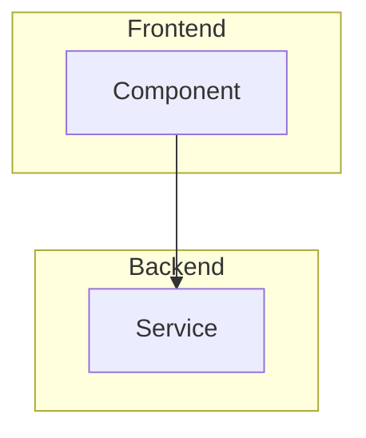

# Claude Code `/design` Command Specification

## Command Overview

Generate comprehensive design documentation from requirements: $ARGUMENTS.
Follow these steps:
1. Read the requirements document from the path specified in $ARGUMENTS
2. Parse and analyze all requirements to understand the feature scope
3. Generate a detailed design document that addresses each requirement
4. Include architecture diagrams, component interfaces, and data models
5. Write the document to the same directory as `design.md`
6. Confirm successful creation of the design file

## Command Syntax

```bash
/design <path-to-requirements.md>
```

Where `<path-to-requirements.md>` is the file path passed as $ARGUMENTS.

### Examples:
```bash
/design .claude/specs/magic-link-auth/requirements.md
/design .claude/specs/user-profile-editing/requirements.md
/design .claude/specs/stripe-payment-integration/requirements.md
```

## Processing Steps

When executing `/design`, process the request as follows:

1. **Read Requirements**: Load and parse the requirements document from $ARGUMENTS
2. **Extract Feature Context**: Identify:
   - Feature name and scope
   - User stories and acceptance criteria
   - Technical stack mentioned
   - Integration points
3. **Generate Design Sections**: Create comprehensive design covering all aspects
4. **Create Diagrams**: Generate Mermaid diagrams for architecture and flows
5. **Write to File**: Save as `design.md` in the same directory as requirements
6. **Validate**: Ensure all requirements are addressed in the design

## Design Document Structure

### 1. Overview Section
- **Purpose**: High-level summary of what's being built
- **Content**:
  - Brief description matching the requirements introduction
  - Technical approach and architecture decisions
  - Key technologies and frameworks to be used
  - Scope boundaries and assumptions

### 2. Architecture Section
- **System Architecture**: High-level component diagram
- **Data Flow**: Sequence diagrams for key user flows
- **Integration Points**: External services and APIs
- **Technology Stack**: Detailed breakdown of all technologies

Include Mermaid diagrams:
```markdown


### 3. Components and Interfaces Section
- **Core Components**: List and describe each component
- **Component Interfaces**: TypeScript interfaces for props
- **API Contracts**: Request/response schemas
- **Event Handlers**: User interactions and system events

### 4. Data Models Section
- **Database Schema**: Table definitions and relationships
- **Data Types**: TypeScript interfaces for entities
- **Validation Rules**: Data constraints and business rules
- **Migration Strategy**: How data changes will be handled

### 5. Error Handling Section
- **Error Types**: Categorize potential errors
- **Handling Strategy**: How each error type is managed
- **User Feedback**: Error messages and recovery flows
- **Logging**: What gets logged and monitoring approach

### 6. Testing Strategy Section
- **Unit Testing**: Component and function testing approach
- **Integration Testing**: End-to-end flow testing
- **Test Data**: Fixtures and mocking strategy
- **Testing Tools**: Specific tools and frameworks

### 7. Security Considerations Section
- **Authentication**: How users are authenticated
- **Authorization**: Permission and access control
- **Data Protection**: Encryption and privacy measures
- **Vulnerability Prevention**: Common attack vectors addressed

### 8. Performance Considerations Section
- **Client-Side**: Bundle size, lazy loading, caching
- **Server-Side**: Query optimization, caching strategy
- **Scalability**: How the system handles growth
- **Monitoring**: Performance metrics and alerts

### 9. Deployment Configuration Section
- **Environments**: Development, staging, production setup
- **CI/CD Pipeline**: Build and deployment process
- **Configuration**: Environment variables and secrets
- **Rollback Strategy**: How to handle failed deployments

## Design Generation Guidelines

### From Requirements to Design

1. **Map User Stories to Components**:
   - Each user story should have corresponding UI/API components
   - Acceptance criteria inform component behavior

2. **Technical Stack Inference**:
   - Use tech stack from requirements if specified
   - Otherwise, infer from project context and modern best practices
   - Maintain consistency with existing project setup

3. **Architecture Decisions**:
   - Choose patterns that best support the requirements
   - Consider maintainability and scalability
   - Document trade-offs and alternatives considered

4. **Detail Level**:
   - Include enough detail for immediate implementation
   - Provide code examples for complex interfaces
   - Add comments explaining non-obvious design choices

### Quality Checklist

Ensure the design document:

1. **Addresses All Requirements**: Every requirement has a design solution
2. **Technical Completeness**: All components, APIs, and data models defined
3. **Visual Clarity**: Diagrams illustrate architecture and flows
4. **Implementation Ready**: Developer can start coding from this design
5. **Testability**: Clear testing approach for all features
6. **Security**: Addresses security implications of the requirements

## Example Transformations

### Input:
```bash
/design .claude/specs/magic-link-auth/requirements.md
```

### Process:
1. Read requirements about magic link authentication
2. Design auth flow with Convex backend
3. Create component architecture for sign-in UI
4. Define user session data models
5. Include security considerations for tokens

### Output:
```
.claude/specs/magic-link-auth/design.md
```

## Special Considerations

### For Different Requirement Types:

**Authentication Features**:
- Include detailed security sections
- Add session management architecture
- Define token/credential storage approach

**UI/UX Features**:
- Include component hierarchy diagrams
- Add interaction flow diagrams
- Define responsive design approach

**Data Features**:
- Emphasize data model design
- Include database indexing strategy
- Add data validation and sanitization

**Integration Features**:
- Detail API contracts extensively
- Include error handling for external services
- Add retry and fallback strategies

### Cross-Cutting Concerns:

Always address:
- Accessibility requirements
- Internationalization readiness
- Logging and monitoring strategy
- Documentation approach

## Error Handling

If $ARGUMENTS is invalid or file not found:
1. Check if the path exists and is readable
2. Verify it's a requirements.md file
3. Provide clear error message with correct usage
4. Suggest checking the path or running /reqs first

If requirements are incomplete:
1. Generate design for available requirements
2. Add TODO sections for missing information
3. Include notes about assumptions made
4. Highlight areas needing clarification

## Best Practices Integration

Following Claude Code best practices:
- Generate complete, implementation-ready designs
- Include all necessary technical details
- Provide visual diagrams for clarity
- Ensure consistency with project patterns
- Make the design document self-contained
- Consider the full development lifecycle