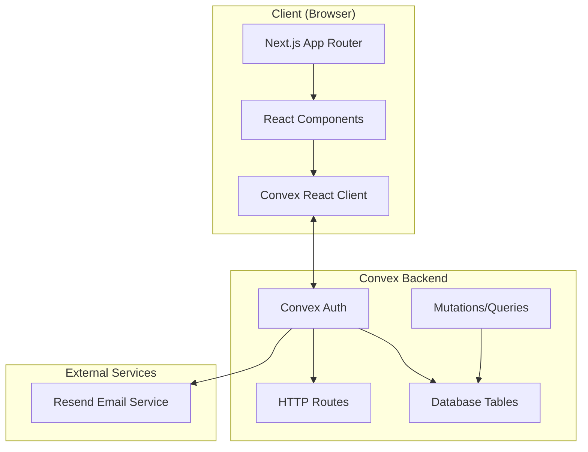
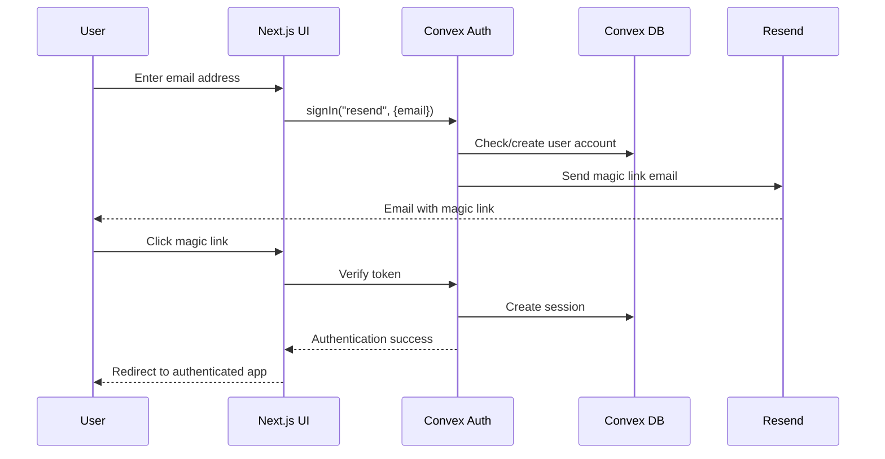

# Design Document

## Overview

This design implements a complete authentication system for the ShipOrSkip Next.js application using Convex as the backend database and Convex Auth with magic link authentication. The system will be built from the ground up, including Convex setup, database schema configuration, authentication flow implementation, and user interface components.

The architecture follows a modern full-stack approach with:
- **Frontend**: Next.js 15 with App Router, React 19, TypeScript
- **Backend**: Convex (serverless backend-as-a-service)
- **Authentication**: Convex Auth with magic links
- **Email Service**: Resend for sending magic link emails
- **UI Components**: Existing shadcn/ui components

## Architecture

### System Architecture



### Authentication Flow



## Components and Interfaces

### Core Components

#### 1. Convex Setup Components
- **ConvexClientProvider**: React context provider for Convex client
- **Environment Configuration**: Environment variables and deployment setup
- **Database Schema**: User and authentication table definitions

#### 2. Authentication Components
- **SignInForm**: Email input form for magic link requests
- **AuthenticationWrapper**: Conditional rendering based on auth state
- **SignOutButton**: User sign-out functionality
- **AuthLoadingSpinner**: Loading state indicator

#### 3. Backend Functions
- **Auth Configuration**: Convex Auth setup with Resend provider
- **HTTP Routes**: Authentication callback handlers
- **User Queries**: Functions to retrieve user data
- **User Mutations**: Functions to update user information

### Component Interfaces

#### ConvexClientProvider
```typescript
interface ConvexClientProviderProps {
  children: React.ReactNode;
}
```

#### SignInForm
```typescript
interface SignInFormProps {
  onSubmit?: (email: string) => void;
  isLoading?: boolean;
  error?: string;
}
```

#### AuthenticationWrapper
```typescript
interface AuthenticationWrapperProps {
  children: React.ReactNode;
  fallback?: React.ReactNode;
}
```

## Data Models

### Database Schema

#### Users Table
```typescript
export const users = defineTable({
  name: v.optional(v.string()),
  email: v.string(),
  image: v.optional(v.string()),
  emailVerified: v.optional(v.number()),
  phone: v.optional(v.string()),
  phoneVerified: v.optional(v.number()),
  isAnonymous: v.optional(v.boolean()),
})
.index("email", ["email"]);
```

#### Authentication Tables (from Convex Auth)
- **authSessions**: User session management
- **authAccounts**: Authentication provider accounts
- **authRefreshTokens**: Token refresh management
- **authVerificationCodes**: Magic link tokens

### Environment Variables

#### Frontend (.env.local)
```
NEXT_PUBLIC_CONVEX_URL=https://your-deployment.convex.cloud
NEXT_PUBLIC_SITE_URL=http://localhost:3000
```

#### Backend (Convex Dashboard)
```
AUTH_RESEND_KEY=your_resend_api_key
SITE_URL=http://localhost:3000
```

## Error Handling

### Error Types and Handling Strategy

#### 1. Authentication Errors
- **Invalid Email**: Client-side validation with user feedback
- **Email Send Failure**: Server-side error with retry mechanism
- **Token Expiration**: Clear error message with option to resend
- **Invalid Token**: Redirect to sign-in with error message

#### 2. Network Errors
- **Connection Issues**: Retry logic with exponential backoff
- **Timeout Errors**: User notification with manual retry option
- **Server Errors**: Graceful degradation with error boundaries

#### 3. Configuration Errors
- **Missing Environment Variables**: Clear error messages in development
- **Invalid Convex URL**: Connection validation on app startup
- **Email Provider Issues**: Fallback error handling

### Error Boundary Implementation
```typescript
interface ErrorBoundaryState {
  hasError: boolean;
  error?: Error;
}

class AuthErrorBoundary extends React.Component<
  { children: React.ReactNode },
  ErrorBoundaryState
> {
  // Error boundary implementation for auth-related errors
}
```

## Testing Strategy

### Unit Testing
- **Authentication Functions**: Test sign-in/sign-out flows
- **Form Validation**: Test email input validation
- **Error Handling**: Test error states and recovery
- **Component Rendering**: Test conditional rendering based on auth state

### Integration Testing
- **Magic Link Flow**: End-to-end authentication testing
- **Database Operations**: Test user creation and session management
- **Email Integration**: Test email sending (with mocks)
- **Route Protection**: Test authenticated vs unauthenticated access

### Testing Tools
- **Jest**: Unit testing framework
- **React Testing Library**: Component testing
- **MSW (Mock Service Worker)**: API mocking for tests
- **Convex Test Utilities**: Backend function testing

## Security Considerations

### Magic Link Security
- **Token Expiration**: Short-lived tokens (15 minutes default)
- **Single Use**: Tokens invalidated after use
- **Secure Generation**: Cryptographically secure random tokens
- **HTTPS Only**: All authentication flows over HTTPS

### Session Management
- **Secure Cookies**: HttpOnly, Secure, SameSite attributes
- **Session Expiration**: Configurable session timeouts
- **Token Refresh**: Automatic token refresh for active users
- **Logout Cleanup**: Complete session cleanup on sign-out

### Email Security
- **Rate Limiting**: Prevent email spam/abuse
- **Domain Validation**: Verify email domains if needed
- **Professional Sender**: Use verified domain for sending
- **Clear Communication**: Transparent email content

## Performance Considerations

### Client-Side Performance
- **Code Splitting**: Lazy load authentication components
- **Optimistic Updates**: Immediate UI feedback for user actions
- **Caching**: Cache user data and authentication state
- **Bundle Size**: Minimize authentication library impact

### Server-Side Performance
- **Database Indexing**: Proper indexes on user lookup fields
- **Connection Pooling**: Efficient database connections
- **Caching Strategy**: Cache frequently accessed user data
- **Rate Limiting**: Protect against abuse

### Email Performance
- **Async Processing**: Non-blocking email sending
- **Retry Logic**: Handle temporary email service failures
- **Template Caching**: Cache email templates
- **Delivery Monitoring**: Track email delivery success

## Deployment Configuration

### Development Environment
- **Local Convex**: Use `npx convex dev` for development
- **Environment Variables**: Local `.env.local` configuration
- **Hot Reloading**: Real-time sync with Convex backend
- **Debug Logging**: Enhanced logging for development

### Production Environment
- **Convex Production**: Separate production deployment
- **Environment Security**: Secure environment variable management
- **Monitoring**: Error tracking and performance monitoring
- **Backup Strategy**: Database backup and recovery procedures

### CI/CD Pipeline
- **Automated Testing**: Run tests on every commit
- **Type Checking**: TypeScript compilation validation
- **Deployment Automation**: Automated deployment to production
- **Rollback Strategy**: Quick rollback capability for issues